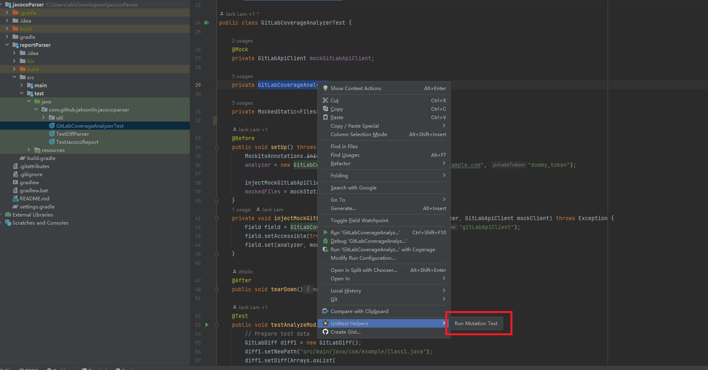
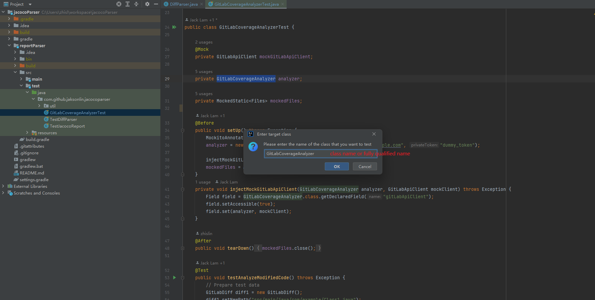
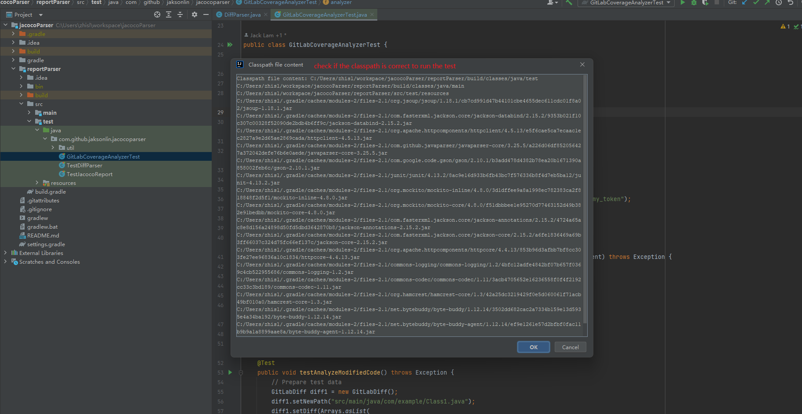
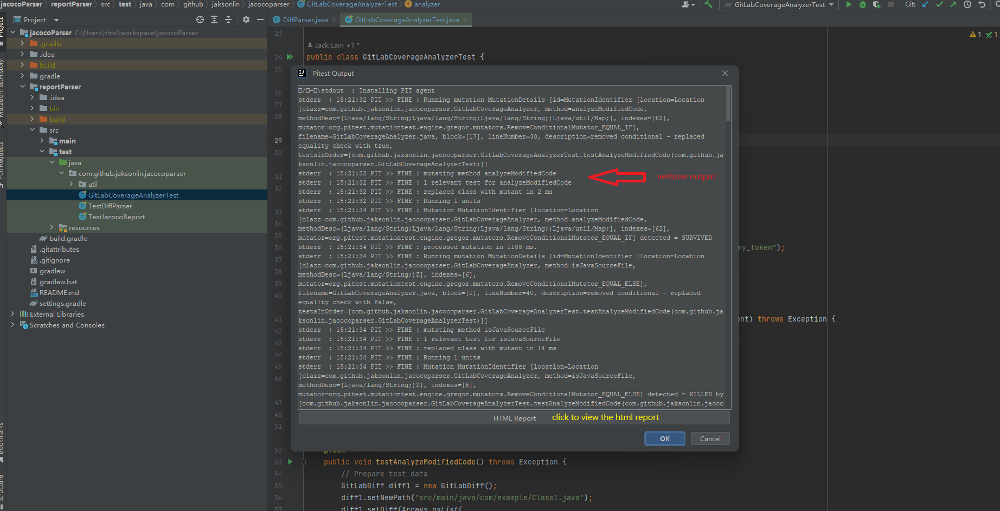
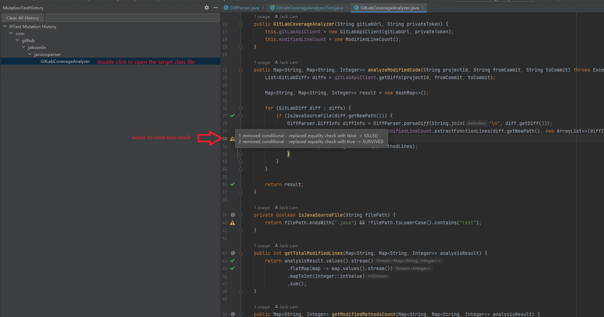
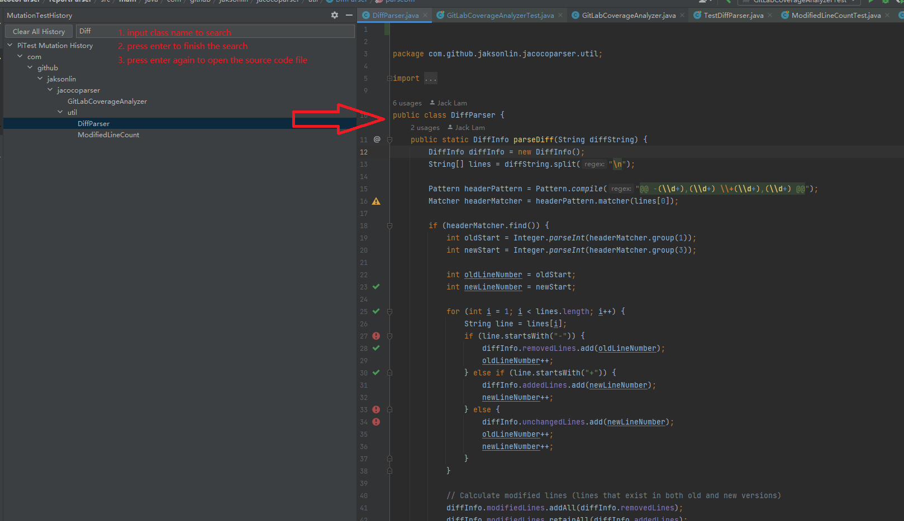

# Pitest-Gradle

<!-- Plugin description -->
This is a plugin for IntelliJ IDEA that allows you to run PITest (https://pitest.org/) mutation testing on your Gradle project.
<!-- Plugin description end -->

## Features
- Run Pitest on your Java Gradle projects
- View mutation test results in a tool window and navigate to the source code
- Decorate the editor of the source code with mutation test results

## Installation

1. Download the latest release from the [releases page]()
2. Open IntelliJ IDEA
3. Go to `File` -> `Settings` -> `Plugins` -> `Install Plugin from Disk...`
4. Select the downloaded `.zip` file

## Usage

1. Open your junit test file, run the test make sure it is passing
2. Right click on the test file and select `Run PIT Mutation Test`
3. Input the target mutation test class, for example `com.example.MyClass` or `MyClass`, and click `OK`
4. The mutation test will run and the results will be displayed in the `Mutation Tool Window`

## Screenshots


To run the plugin, right click on the test file and select `Run Mutation Test` in the `Unittest Helpers` menu.




Input the target mutation test class, for example `com.example.MyClass` or `MyClass`, and click `OK`



It will prompt you with the collected classpath information, click `OK` (you can also click `Cancel` to stop the mutation test)



The mutation test will run; and upon finishing, it will popup a dialog with the verbose output of the mutation test, as well as a button to view the results in the browser



You can also navigate to the `MutationTestHistory` tool window to view the results; 
double click on a row to will open the code editor to the class under test, and the editor will be decorated with the mutation test results



`MutationTestHistory` tool window also support searching, input the class name and press enter to locate the class; and a second enter will open the code editor to the class under test.




## Known Issues

- [ ] it cannot find the classpath if the project is not managed by Gradle, click on the Project structure and import the project as Gradle project
- [ ] it cannot find the resource directory if you don't mark the directory as resource root, right click on the directory and mark as resource root

## runPluginVerifier

```shell
./gradlew runPluginVerifier
```
```
2024-10-12T18:50:17 [main] INFO  verification - Finished 1 of 8 verifications (in 2.1 s): IC-223.8836.26 against com.github.jaksonlin.pitestintellij:1.0.1-beta: Compatible
2024-10-12T18:50:17 [main] INFO  verification - Finished 2 of 8 verifications (in 2.1 s): IC-232.10335.12 against com.github.jaksonlin.pitestintellij:1.0.1-beta: Compatible
2024-10-12T18:50:17 [main] INFO  verification - Finished 3 of 8 verifications (in 2.1 s): IC-233.15619.7 against com.github.jaksonlin.pitestintellij:1.0.1-beta: Compatible
2024-10-12T18:50:17 [main] INFO  verification - Finished 4 of 8 verifications (in 2.1 s): IC-231.9423.9 against com.github.jaksonlin.pitestintellij:1.0.1-beta: Compatible
2024-10-12T18:50:17 [main] INFO  verification - Finished 5 of 8 verifications (in 2.1 s): IC-222.4554.5 against com.github.jaksonlin.pitestintellij:1.0.1-beta: Compatible
2024-10-12T18:50:17 [main] INFO  verification - Finished 6 of 8 verifications (in 2.1 s): IC-241.19072.14 against com.github.jaksonlin.pitestintellij:1.0.1-beta: Compatible
2024-10-12T18:50:17 [main] INFO  verification - Finished 7 of 8 verifications (in 2.1 s): IC-242.23726.16 against com.github.jaksonlin.pitestintellij:1.0.1-beta: Compatible
2024-10-12T18:50:25 [main] INFO  verification - Finished 8 of 8 verifications (in 10.4 s): IC-243.19420.21 against com.github.jaksonlin.pitestintellij:1.0.1-beta: Compatible

```